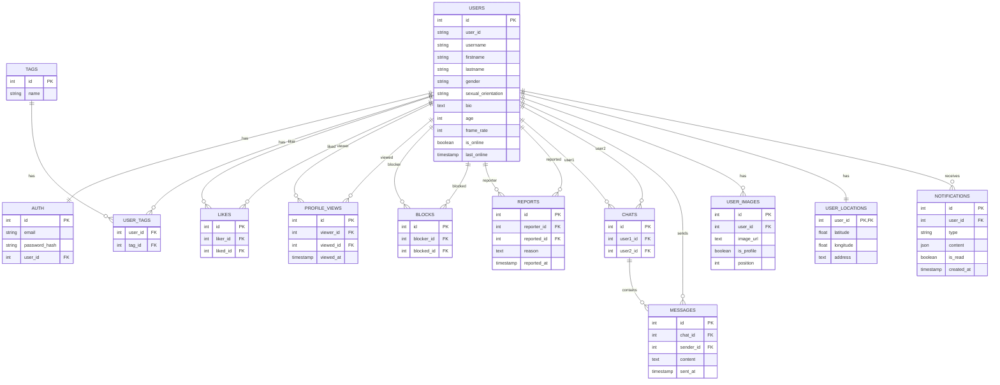

# Database

## How to enter the container

```bash
docker exec -it <container>  psql -U <user name> -d <database name>
```

### Consult tables
```bash
	#see all tables
	\dt
	#see table schema
	\d <table name> 
	\d+ <table name>
```

## Diagram

